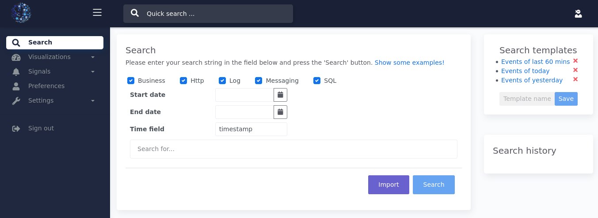

# Searching events
So, you've set up your Enterprise Telemetry Monitor nodes and your processors are handling thousands of events per second. Now it's time to take advantage of the performance and simplicity Enterprise Telemetry Monitor has to offer.

To search through all events browse to <http://localhost:8080/gui/search/> or select the menu option *Search*. The first time you enter this page it looks similar to the image below.

**Search overview**
