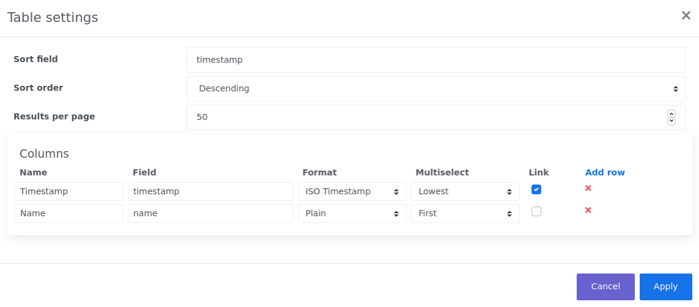

# Search results widget
As soon as a query is executed the Search result widget will show up. This widget will show you the events that match your query. The default layout of the Search result widget may look like this:

**Search results**

The sorting order can be adjusted by clicking on the column header and auto-scrolling through the results will kick in as soon as your browser hit the end of the page. The top of the result table is showing the number of events that match the query and the ones that are shown. 

## Editing the result table layout
By default only the lowest handling time of any of the writing event handlers and the name of the event will be shown. This may be a good starting point for most of the queries, but is most likely not covering all of your needs. Fortunately all table settings can be adjusted by selecting *Edit result table* from the Search result widget context menu. The context menu is accessible by clicking on the three horizontal bars at the top right corner of the widget. The following screen will show up when you click on the button:

**Edit search results table**

This screen enables you to change sort settings and the number of results per page that should be retrieved. Also an option is given to alter the column layout of the result table. Columns can be added, deleted an re-arranged. Per column the following options are available:

**Column attributes**
Name | Description
--- | ---
Name | The name of the column in the result table.
Field | The event attribute that should be retrieved.
Format | The format the result should have. Time values are stored as milliseconds since January 1st 1970. This is kind of hard to read so you it's easier to convert this value to an ISO timestamp. Note that timestamp formats will show two hourglasses when hovering over the cell in the result table. These hourglasses are shortcuts for using that specific time as start or end date for your next query.
Multiselect | Some attributes may occur more than ones in a single event. An event can have a writing event handler per endpoint. So if you want to show the handling time of a writing event handler of an event with multiple endpoints Enterprise Telemetry Monitor has to pick one. This option tells which value should be selected in case of a multi-occurrence attribute.  
Link | A checkbox that should be checked if the value should be clickable. If a value is clickable it will be presented as a link in the result table. When clicking this link the details of the event will be shown.

When clicking on the apply button the query will be automatically executed again and the results are then presented in the way you desired. The layout of your result table will also be stored in a search template and in the queries stored in the [Search history widget](search-result-widget.md).

## Downloading results
If you want to export your search results you can download them as .csv or .xlsx file. When selecting *Download results* from the context menu a popup will be shown giving you some download options. You can select to include the payload in the download and change the number of rows you want to be exported. Besides the payload the columns that are configured in the result table will be included. Be aware that an Enterprise Telemetry Monitor administrator can set a maximum number of rows that can be exported. 

When clicking the Download button your export will be presented as downloadable file.

To prevent a large file stored in memory Enterprise Telemetry Monitor writes the export file to disk before it is offered as download. The directory referenced by the java.io.tmpdir system property will be used to store the export temporarily. Make sure the Enterprise Telemetry Monitor process has access to that directory.

## Inspecting found events
If any of the columns in the result table is configured as link you can inspect the details of an event. By clicking on that link all data of that event and the events correlated will be shown. Depending on the event type the layout of this screen may differ; for 'http' and 'messaging' events a request and reply tab may be visible. If a transaction id is present with the event an *Endpoints* and *Chain times* tab is shown that shows the complete event chain in a graphical way! If you are allowed to view these events you can click on the desired items in the image to show more details of that specific event. When the payload format of the event is set to 'XML', 'SOAP', 'JSON' or 'SQL' the payload will be formatted to make it more readable. You can copy the raw unformatted content by clicking on 'Copy raw payload to clipboard' on the top left of the payload details. You can navigate back to the search results by clicking the 'Back' button or link. The last selected event will be formatted bold in the search result widget to quickly indicate where you left scrolling your results.

::: tip Note
Although you may not have access right to see all events the *Endpoints* tab will always show all the event that belong to that chain. This may help you greatly reduce time on finding issues in your application landscape.
:::

Lets consider the following event chain:

This chain shows an incoming (received) http request, a sent ShoppingCardRequest and finally a received ShoppingCardRequest chronologically plotted on time. Hovering over one of the time bars show the application and endpoint information. As you can see the bottom time bar is filled for 87%. This indicates that 87% of the total transaction time is spent in that request. When you are experiencing performance issues the 'ShoppingCardRequest (received)' event is a good place to start your investigation.

By clicking on the bottom time bar you will see everything that happened within that transaction:

 
As we can see the query that selected the shopping card from the database took about 300 milliseconds. Depending on your needs that might or might not be an issue. Nevertheless Enterprise Telemetry Monitor will give you a quick inside in what is happening where an what applications and components take most of the execution time of an entire application chain. That is awesome isn't it?

You might have noticed the 'ShoppingCardRequest (sent)' event also takes about 1.9% of transaction time. That's a little bit odd isn't it? How can an event being sent take processing time? Well, it can't.. The percentage shown of sent events is the latency of the event before it is processed by an application, added with the latency of the response. In this example the sent request and received response have been on a queue for 1.9% of the total transaction time.

::: tip Note
If you have audit log access rights and the audit logs are kept long enough you may see an extra *Audit Logs* tab. This tab shows information over who saw this particular event over time. When the column *Direct* contains the value *true* then the user clicked on this event. When the column contains the value *false* the event was retrieved as a correlated event.
:::

Finally, if you want a complete overview of all your endpoints and the corresponding dataflow through your applications you can click on the *Endpoints* tab. This will give you a nice animated view of the entire chain. Also, the items on this image are clickable as with the *Chain times* tab.

