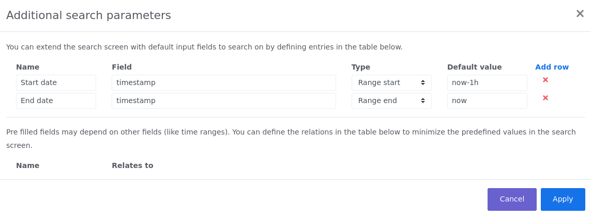

# Search widget
In the search widget you can define the queries you want to execute. To maximize flexibility most of this widget is customizable.
By default this widget will allow you to enter a time range to scope the query, and the query input field. 

To select an specific date you can enter that date and time, or select the appropriate value from the popup calendar. If the time range should be more flexible
you can also provide an [Elasticsearch Date Math](https://www.elastic.co/guide/en/elasticsearch/reference/7.x/common-options.html#date-math) expression. In the time field you can enter
the name of a field in which the time range should fall.

In the query input field you can enter the terms you are searching for. See the section [Query syntax](query-syntax.md) for the query syntax that can be used. The query input field 
provides a basic form of auto completion by hitting `ctrl + space` buttons on your keyboard. All available attributes for the selected event types will be show in a drop down box.
If you want to make your query more readable you can hit the `shift + enter` keys to place the cursor on a new line.

## Additional search parameters
When you use certain query parameters a lot, it makes sense to add them as a separate query field on the search widget. To add or remove input field visible on the search 
widget you can click on the three horizontal bars at the top right corner of the search widget. Select the `Edit search parameters` option and a popup with a similar content
will appear.

**Manage search parameters**

To add a new input field click on the `Add row` header in the table. You can give the field a representable name and put the field you want to add in the `Field` column.
Depending on the `Type` you select the query will act as follow:

Field type | Description
--- | ---
Free format | The field will be a regular input field in which you can type anything you want. 
Range start | The field will be a regular input field for the field type. When executing a query the field should be greater than or equal to the given value.
Range end | The field will be a regular input field for the field type. When executing a query the field should be less than or equal to the given value.
Select | The field will be a drop down box from which you can select a single value.
Select multi | The field will be a drop down box from which you can select one or more values.

:::warning Note
There will never be more than 100 distinct values in a `Select` or `Select multi` field. A `Free format` field should be used in those case where there are 
more that 100 distinct values.
:::

Finally you can add a default value for the field. When you want to provide multiple default values for a `Select multi` typed field you should provide the appropriate values as a comma separated list. 

The distinct values loaded in the `Select` and `Select multi` fields can be made dependant on other fields. If you, for example, want to add a `Select` field on the name
of an application you can make the values of the drop down box dependent of the time range you've provided. For all field that have the appropriate `Field type` a row will
be added at the bottom of the popup screen. You can select the dependency from that field to the other fields. Make sure you won't provide a cyclic dependency!

If you, for example, want to be able to add a filter on the application name and application instance in the search widget you could configure it as follow:

**Application search parameters**

The application field will be dependant on the time range you provide, and the application instance will be dependant to the time range and the selected application as well.

## Export and import queries
Besides storing frequently used queries as [template](search-template-widget.md) you can also export and import a query to a file. Exporting a query is as simple as selecting 
the `Export query` option in the context menu of the widget. The export will contain all options you provided in the query, including any additional search parameters. 

When a user imports that resulting file via the `Import query` context menu Enterprise Telemetry Monitor will try to map the additional search parameters from the file to
the additional search parameters of the user. When no field can be found the additional search parameter will be converted and added to the query input field. 