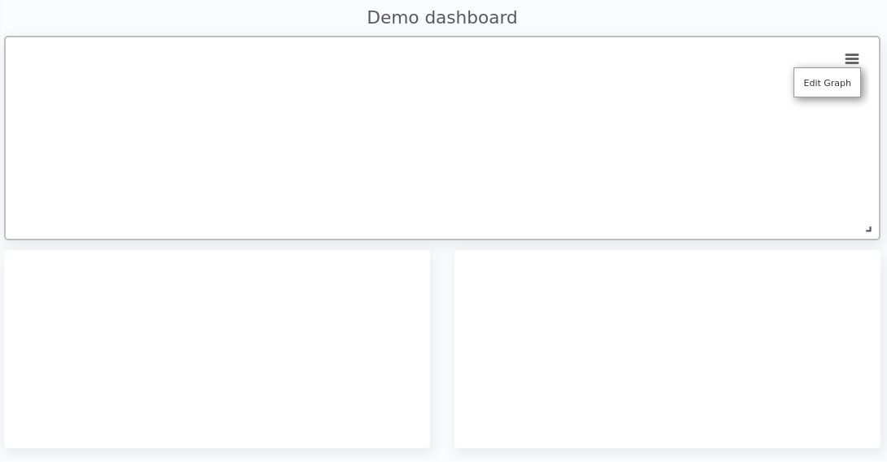
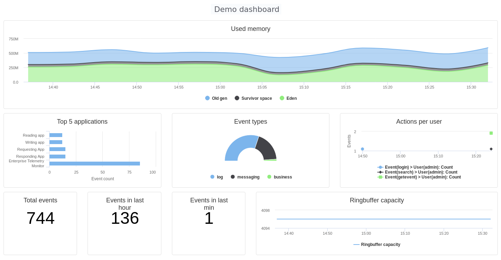

# Dashboards
After adding some [Graphs](graphs.md) it is time to create your first dashboard. To add, modify or delete dashboards browse to <http://localhost:8080/gui/dashboard/dashboards.html> or select the menu option *Visualizations -> Dashboards*. Note that the menu option might be contain a submenu with your username and the groups you belong to. This extra submenu will give you the opportunity to create a dashboard for a group or just for yourself.
A dashboard contains of a set of horizontal rows below each other. Each row can be split into columns and each column can contain a graph.

On the first screen you can enter a dashboard name and add some rows. Change the number of columns per row as needed, and give the rows a suitable height. Don't worry over the exact height of each row right now. When the dashboard is create you can drag the height to the best fit for your screen. When you're done organizing your rows and columns click on the *Save and show* button to go to your dashboard. Your dashboard might look like the following image:

Not much to see there right? The only thing left is to add some [Graphs](graphs.md) to the dashboard. When hovering over a graph container the green edit button of that container will show up in the top right corner. A model window will show up with all settings applied to that specific container. Go ahead and select a graph you wish to display. Depending on the graph type several other options will be shown:

When finished hit the apply button and your graph will be added to the dashboard. There is no need to save the dashboard again, changes are automatically stored.

A graph on a dashboard can have the following attributes:

Name | Description
--- | ---
Graph title | The title that appears on top of the graph container in the dashboard.
Border | A boolean telling the graph container to display a border around the graph.
Refresh rate | The rate in seconds the data of the graph should be refreshed.

Besides the attributes listed above most options of the [Data section](graphs.md#data-section) and [Graph section](graphs.md#graph-section) are available as well. By changing these settings you will override the default settings as applied at the Graph.
The selected Graph will act as a template and won't be changed when changing any of the attributes in the Dashboard.

Repeat these steps for all graph containers and your dashboard may look like this:

.Dashboard

When you want to edit the dashboard settings click on the dashboard name and the initial screen will show up. To resize your graph containers drag the bottom right corner of the specific container around on your screen until it has the appropriate size. The dashboard will be automatically saved when any of the graph containers is resized.