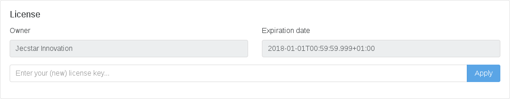

== Administrating {etm}
Apart from the <<Node configuration>> {etm} can be configured with a browser. At least one Node with the ''guiEnabled'' to ''true'' should be available. 

=== License registration
One of the first things you need to do as administrator is entering your license key. Without a proper license no events will be processed. When your license is expired or not entered you will be able to access all features of {etm}. The only part that is disabled is the processing of events.
To enter your license or view the state of your current license, open a browser and browse to http://localhost:8080/gui/settings/license.html (Of course your server name and port may be different). If you are already logged in to {etm} you can access the license page through the menu optiosn ''Settings -> License''.
Paste your license key in the input field and hit the ''Apply'' button. If you entered a valid license, the Owner and Expiration Date will become visible.

A correctly applied license looks something like this:

.{etm} license

=== Users
To add, create or modify users browse to http://localhost:8080/gui/settings/users.html or select the menu option ''Settings -> Users''. The top drop-down bar allows you to select a user to modify, delete or copy. It is highly recommended to remove the default administrator user! At least change the password of the user.

Each user can have the following attributes:
.User attributes
[options="header"]
|=======================
|Name|Description
|Id|The unique ID of the user. This id is also used for logging in to the {etm} Gui.
|Name|The (full) name of the user. 
|Groups|The groups to apply to the user. This field will only be available if at least one group is created. See <<Groups>> for more information.
|Filter query|The filter query that needs to be applied to the user. See <<Filter query>> for more information.
|Filter query occurrence|The occurrence of the filter query. See <<Filter query>> for more information.
|Locale|The locale of the user.
|Time zone|The time zone the user is in. Time based properties will be converted to the selected time zone.
|Search history size|The number of queries that need to be remembered.
|User roles|The roles the user has. See <<User roles>> for a detailed description.
|New password|The new password for the user. This field is mandatory when adding a new user.
|Retype password|Retype the new password in this field to make sure you didn't enter a typo in the New password field.
|======================= 

==== User roles
Each user can have one or more roles. Depending on the roles the user has, he or she can or can't access some parts of the {etm} Gui.

[horizontal]
Admin:: If checked the user can access all parts of {etm} without any restrictions.
Searcher:: With this role the user can search for events.
Controller:: When a user has the controller role he or she can access the dashboard.
Processor:: With this role the user can add events by posting to the rest processor. By default the rest processor hasn't any access restrictions so everybody can use it. If security is applied to the rest processor only users with the Processor role can use the rest processor.
Iib-admin:: With this role the user can manage the creation if IIB Monitoring Event from the Settings menu. See <<Integration with IBM MQ and/or IBM Integration Bus>> to enable this integration.

==== Filter query
Imagine you have stored a gazillion events in {etm}. Some of them might contain passwords or other sensitive data and you don't want this data to be visible to everyone with a Searcher role. This is were the Filter query is your best friend. When an Filter query is applied to a user (or group) it is attached to every query the user executes. For example, when we configure

[source]
----
endpoints.writing_endpoint_handler.application.name: "Enterprise Telemetry Monitor"
----

as a Filter query for user Bob, every time Bob enters a query the query will be extended with this filter query. If Bob searches for

[source]
----
name: BobsEventName
----

under the hood {etm} will query for:

[source]
----
name: BobsEventName AND endpoints.writing_endpoint_handler.application.name: "Enterprise Telemetry Monitor"
----

This way we can prevent Bob of seeing any events that are not generated by the application "Enterprise Telemetry Monitor".
The above example assumed the value ''Must'' was selected in the Filter query occurrence options field. If the value is changed to ''Must not'' {etm} would hav executed the following query:

[source]
----
name: BobsEventName AND NOT endpoints.writing_endpoint_handler.application.name: "Enterprise Telemetry Monitor"
----

In this case Bob can see all events, but not the ones generated by the application "Enterprise Telemetry Monitor". When combined with <<Groups>> a very flexible and powerful set of access rules can be applied.

=== Groups
To add, create or modify groups browse to http://localhost:8080/gui/settings/groups.html or select the menu option ''Settings -> Groups''. Groups are a convenient way of managing some user attributes that should be applied to several users. You can, for example, create an administration group that has the Administration role selected. When a user is added to that role the Administration role is also applied to that user.

When a user is added to multiple groups he has the roles and Filter queries of all groups combined.

=== Cluster
To manage your cluster settings browse to http://localhost:8080/gui/settings/cluster.html or select the menu option ''Settings -> cluster''. On the cluster settings page you can adjust several settings that help you keep your cluster performing the way you want. By default most of the settings should be fine, but if you want to make optimal use of each CPU cycle your cluster has to offer you have the option to tune it on this page.

.Cluster settings
[options="header"]
|=======================
|Name|Description
|Shards per index|Each day at 00:00 UTC a new Elasticsearch index is created. This option sets the number of https://www.elastic.co/guide/en/elasticsearch/reference/5.x/_basic_concepts.html#_shards_amp_replicas[shards] in each new index.
|Replicas per index|The number of https://www.elastic.co/guide/en/elasticsearch/reference/5.x/_basic_concepts.html#_shards_amp_replicas[replica's] each Elasticsearch index should have. Leave this value to zero if you have only one Elasticsearch instance in your cluster.
|Max event indices|The number of event indices to keep. Each day at 00:00 UTC a new Elasticsearch index is created. This means that setting this value to 10 will keep your events at least 9 days, depending on your local time zone.
|Max metrics indices|The number of metrics indices to keep. Each {etm} node generates metrices to the metrics index of the current day. This index cannot be queries, but is useful to monitor your {etm} cluster health.
|Wait for active shards|The number of Elasticsearch shards that need to be active before performing any query. Leave this value to 1 if you have only one Elasticsearch instance in your cluster, or have not configured any Replicas.
|Retries on conflict|The number of retries before an insert or update query will fail.
|Query timeout|The timeout in milliseconds for queries to Elasticsearch.
|Search export max rows|The maximum number of rows that can be exported from the search page. If you set this value to high it might lead to a very high memory consumption of your {etm} Node.
|Max search templates|The maximum number of search templates a user may have stored.
|Max search history size|The maximum number of queries that are kept in the users query history. An individual user may configure a lower number for him/herself.
|Enhancing handler count|The number of threads that will be used by the event enhancer in the Processor.
|Persisting handler count|The number of threads that will be used by the event persister in the Processor. 
|Event buffer size|The maximum number of event that can be buffered by the Processor before they are offered to the event enhancer and event persister.
|Persisting bulk count|The maximum number of events that can be buffered before flushed to an Elasticsearch node.
|Persisting bulk size|The maximum combined size in bytes of events that can be buffered before flushed to an Elasticsearch node.
|Persisting bulk time|The maximum number of millisecond that events can be buffered before flushed to an Elasticsearch node.
|======================= 

When changing any of these properties no restart is required. All settings will be automatically applied within 30 seconds. For some settings a hot-restart of the processor is required. This may cause a little latency peek in the Processor.

=== Parsers
To add, modify or delete parsers browse to http://localhost:8080/gui/settings/parsers.html or select the menu option ''Settings -> Parsers''. Parsers are used to extract information from an event so it can be categorized and/or enhanced with custom values based on the content of an event.

A parser describes a way of extracting data from an event, nothing more nothing less. 

==== Fixed position parser
The fixed position parser extract information from the content of an event at a fixed position. This parser can be useful if you are dealing with content that has a static layout like good old COBOL records.

==== Fixed value parser
The Fixed value parser provides a fixed value no matter what content it is feeded with. Strictly speaking this is not a parser, but always provides the same value.

==== JsonPath parser
The JsonPath parser is capable of extracting data from json content. There's no formal standard describing the Json path standard, but {etm} is following http://goessner.net/articles/JsonPath/[Stefan Goessner's JsonPath implementation].

==== XPath parser
The XPath parser can extract data from XML based content. XPath 2.0, 3,0 & 3.1 queries are supported to extract data from any XML and/or Soap events.

==== XSLT parser
The XLST parser can extract data from XML based content. All XSLT 2.0 compatible templates are supported to extract data from any XML and/or Soap events.
 
=== Endpoints

=== IIB Nodes

=== IIB Events