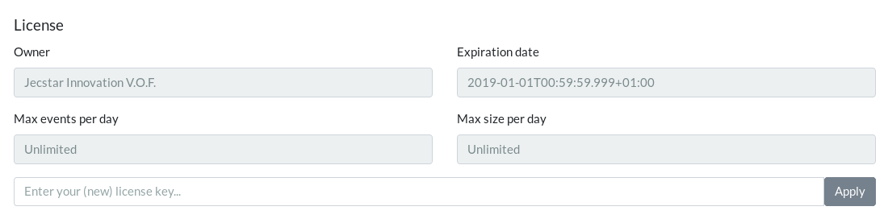

== Administrating {etm}
Apart from the <<Node configuration>> {etm} can be configured with a browser. At least one Node should be configured with the ''guiEnabled'' option set to ''true''. 

=== License registration
One of the first things you need to do as administrator is entering your license key. Without a proper license no events will be processed. When your license is expired or not entered you will be able to access all features of {etm}. The only part that is disabled is the processing of events.
To enter your license or view the state of your current license, open a browser and browse to http://localhost:8080/gui/settings/license.html (Of course your server name and port may be different). If you are already logged in to {etm} you can access the license page through the menu options ''Settings -> License''.
Paste your license key in the input field and hit the ''Apply'' button. If you entered a valid license the license data will become visible.

A correctly applied license looks something like this:

.{etm} license

{etm} can be used with a free license. When possible it will be automatically retrieved and applied. This license allows you to index 1000 event or 100 MiB every day. This free license will be valid for 7 days. Within the last 12 hours before the license will expire it will be automatically refreshed. If your server can't connect to the internet you can manually download the license from the https://www.jecstar.com/licenses/index.html[Jecstar website]. 

=== Users
To add, create or modify users browse to http://localhost:8080/gui/settings/users.html or select the menu option ''Settings -> Users''. The top drop-down field allows you to select a user to modify, delete or copy. It is highly recommended to remove the default administrator user for security reasons! You should at least change the password of the default administrator user.

Each user can have the following attributes:
.User attributes
[options="header"]
|=======================
|Name|Description
|Id|The unique id of the user. This id is also used for logging in to the {etm} Gui.
|Name|The (full) name of the user. 
|Groups|The groups the user belongs to. This field will only be available if at least one group is created or when an ldap connection is setup. When the user is synchronized with an ldap server only the membership of imported ldap groups are shown. See <<Groups>> for more information.
|Filter query|The filter query that needs to be applied to the user. See <<Filter query>> for more information.
|Filter query occurrence|The occurrence of the filter query. See <<Filter query>> for more information.
|Always show correlated events|Always show directly correlated events in the event detail screen even when they normally would be filtered by a <<Filter query>>. Note that this does not mean that those correlated events will be shown in the <<Search results widget>>. This feature can, for example, be useful if you apply a filter that shows only request, but you want to be able to view the correlated responses in the event detail screen as well.   
|Locale|The locale of the user.
|Time zone|The time zone the user is in. Time based properties will be converted to the selected time zone.
|Search history size|The number of queries that need to be remembered.
|Default search time range|The default time range (in seconds) on the search screen to query. For example, if you set
this value to 60 the last 60 seconds will be queried by default when entering the search screen.
|Access control|The roles the user should have. See <<User roles>> for a detailed description.
|Change password on logon|The user is forced to change the password on the next logon, or in the current session if the user is already logged on.
|New password|The new password for the user. This field is mandatory when adding a new user.
|Retype password|Retype the new password in this field to make sure you didn't enter a typo in the ''New password'' field.
|======================= 

==== User roles
Each user can have one or more roles. Depending on the roles the user has, he or she can or can't access some parts of the {etm} Gui. For most roles on of the
values 'None', 'Read', 'Write' or 'Read & write' can be assigned. Depending on your selection it will give the user or group no access or a combination of read
and write access to a certain resource.

The following resources are available:
[options="header"]
|=======================
|Name|Access to
|Audit logs|Menu option ''Settings -> Audit logs''
|Cluster settings|Menu option ''Settings -> Cluster''
|Endpoint settings|Menu option ''Settings -> Endpoints''
|Events|Menu option ''Search'' for read access and the <<Rest processor>> for write access.
|Group dashboards|Menu option ''Visualizations -> <groupname> -> *''
|Group settings|Menu option ''Settings -> Groups''
|Group signals|Menu option ''Signals -> <groupname>''
|IIB events|Menu option ''Settings -> IIB events''
|IIB nodes|Menu option ''Settings -> IIB nodes''
|Index statistics|Menu option ''Settings -> Index statistics''
|License|Menu option ''Settings -> License''
|Node settings|Menu option ''Settings -> Nodes''
|Notifiers|Menu option ''Settings -> Notifiers''
|Parser settings|Menu option ''Settings -> Parsers''
|User dashboards|Menu option ''Visualizations -> <username> -> *''
|User settings|Menu option ''Settings -> Users''
|User signals|Menu option ''Signals -> <username>''
|=======================

==== Filter query
Imagine you have stored a gazillion events in {etm}. Some of them might contain credentials or other sensitive data and you don't want this data to be visible to everyone with read access to Events. This is were the Filter query is your best friend. When an Filter query is applied to a user (or group) it is attached to every query the user executes. For example, when we configure

[source]
----
endpoints.writing_endpoint_handler.application.name: "Enterprise Telemetry Monitor"
----

as a Filter query for user Bob, every time Bob enters a query the query will be extended with this filter query. If Bob searches for

[source]
----
name: BobsEventName
----

under the hood {etm} will query for:

[source]
----
name: BobsEventName AND endpoints.writing_endpoint_handler.application.name: "Enterprise Telemetry Monitor"
----

This way we can prevent Bob of seeing any events that are not generated by the application "Enterprise Telemetry Monitor".
The above example assumed the value ''Must'' was selected in the Filter query occurrence options field. If the value is changed to ''Must not'' {etm} would have executed the following query:

[source]
----
name: BobsEventName AND NOT endpoints.writing_endpoint_handler.application.name: "Enterprise Telemetry Monitor"
----

In this case Bob can see all events, but not the ones generated by the application "Enterprise Telemetry Monitor". When combined with <<Groups>> a very flexible and powerful set of access rules can be applied.

==== Import user from ldap
In case you have configured a ldap server in the <<Ldap settings>> you can import an user by clicking on the ''Import'' button. Enter the id of the user you want to import and confirm your input by clicking on the ''Import'' button. You don't need to import all users from your ldap server. When an user successfully logs in into {etm} by providing his/her ldap credentials the account will automatically be synchronized. Though you have to make sure at least one ldap group the user belongs to is imported into {etm}.    

=== Groups
To add, create or modify groups browse to http://localhost:8080/gui/settings/groups.html or select the menu option ''Settings -> Groups''. Groups are a convenient way of managing some user attributes that should be applied to several users. You can, for example, create an administration group that has read and write access to User settings. When a user is added to that group the read and write access to User settings is also applied to that user.

When a user is added to multiple groups he or she has the access roles and Filter queries of all groups combined. Also if any of the groups of an user has the ''Always show correlated events'' option set to ''Yes'' the correlated events will be shown in the event detail screen.

==== Import group from ldap
In case you have configured a ldap server in the <<Ldap settings>> you can import a group by clicking on the ''Import'' button. Select the group you want to import and confirm your selection by clicking on the ''Import'' button. Make sure you assign at least one read and/or write permission to the group otherwise users that are member of that group have no access rights!

=== Cluster
To manage your cluster settings browse to http://localhost:8080/gui/settings/cluster.html or select the menu option ''Settings -> Cluster''. On the cluster settings page you can adjust several settings that help you keep your cluster performing the way you want. By default most of the settings should be fine, but if you want to make optimal use of each CPU cycle your cluster has to offer you have the option to tune it on this page.

When changing any of these properties no restart is required. All settings will be automatically applied within 60 seconds. For some settings a hot-restart of the processor is required. This may cause a little latency peek in the Processor.

The cluster page has grouped related configuration items into several tabs:

==== General settings
.General settings
[options="header"]
|=======================
|Name|Description
|Http session timeout|The maximum idle time in milliseconds for an http session before it will be cleaned up. All http sessions are stored in Elasticsearch to provide maximum flexibility in starting and stopping different nodes. An http session will always be available on all nodes to provide High Availablilty out of the box. 
|Search export max rows|The maximum number of rows that can be exported from the search page. If you set this value to high it might lead to a very high memory consumption of your {etm} Node.
|Max search templates|The maximum number of search templates a user may store.
|Max search history size|The maximum number of queries that are kept in the users query history. An individual user may configure a lower number for him/herself.
|Max graphs|The maximum number of graphs that can be stored by a single user or group.
|Max dashboards|The maximum number of dashboards that can be stored by a single user or group.
|Max signals|The maximum number of signals that can be stored by a single user or group.
|=======================

==== Elasticsearch settings 
.Elasticsearch settings
[options="header"]
|=======================
|Name|Description
|Shards per index|Each day at 00:00 UTC a new Elasticsearch index is created. This option sets the number of https://www.elastic.co/guide/en/elasticsearch/reference/5.x/_basic_concepts.html#_shards_amp_replicas[shards] in each new index.
|Replicas per index|The number of https://www.elastic.co/guide/en/elasticsearch/reference/5.x/_basic_concepts.html#_shards_amp_replicas[replica's] each Elasticsearch index should have. Leave this value to zero if you have only one Elasticsearch instance in your cluster.
|Max event indices|The number of event indices to keep. Each day at 00:00 UTC a new Elasticsearch index is created. This means that setting this value to 10 will keep your events at least 9 days, depending on your local time zone.
|Max metrics indices|The number of metrics indices to keep. Each {etm} node generates metrics to the metrics index of the current day. This index cannot be queried, but is useful to monitor your {etm} cluster health.
|Max audit log indices|The number of audit logs indices to keep. This index cannot be queried, but keeps your audit logs to see who is doing what in {etm}.
|Wait for active shards|The number of Elasticsearch shards that need to be active before performing any query. Leave this value to 1 if you have only one Elasticsearch instance in your cluster, or have not configured any Replicas.
|Retries on conflict|The number of retries before an insert or update query will fail.
|Query timeout|The timeout in milliseconds for queries to Elasticsearch.
|=======================

==== Persisting settings
.Persisting settings
[options="header"]
|=======================
|Name|Description
|Enhancing handler count|The number of threads that will be used by the event enhancer in the Processor.
|Persisting handler count|The number of threads that will be used by the event persister in the Processor. 
|Event buffer size|The maximum number of event that can be buffered by the Processor before they are offered to the event enhancer and event persister.
|Wait strategy|The strategy to use when the event processor is waiting for events. The ''Blocking'' strategy can be used when low-latency are not as important as CPU resources. The ''Busy spin'' strategy will use CPU cycles to avoid syscalls. Syscalls will cause a peek in latency. The ''Sleeping'' strategy will consume less CPU resources over time, but has also a greater latency peek over time. The ''Yielding'' strategy is a good compromise between performance and CPU resource without incurring significant latency spikes. 
|Persisting bulk count|The maximum number of events that can be buffered before flushed to an Elasticsearch node.
|Persisting bulk size|The maximum combined size in bytes of events that can be buffered before flushed to an Elasticsearch node.
|Persisting bulk time|The maximum number of millisecond that events can be buffered before flushed to an Elasticsearch node.
|=======================

==== Ldap settings
.Ldap settings
[options="header"]
|=======================
|Name|Description
|Ldap host|The hostname or ip-address the ldap server is running on.
|Ldap port|The port number the ldap server is listening on.
|Connection security|Select the connection security that applies to the ldap server.
|Bind DN|The Distinguished Name (DN) of the user that is conencting to the ldap server.
|Bind password|The password used to connect to the ldap server. Note that this password will be base64 encoded into the database. Make sure only {etm} has access to your database!
|Min connections|The minimum number of connections to the ldap server in the connection pool. 
|Max connections|The maximum number of connections to the ldap server in the connection pool.
|Connection test base DN|The base DN used to perform a connection test query on.  
|Connection test search filter|The search filter used to perform a connection test query. No connection test will be executed when you leave this field empty. 
|Group base DN|The base DN for all groups that need to be synchronized with {etm}. 
|Group search filter|The search filter for groups that need to be synchronized with {etm}. Make sure you use the variable ''{group}'' on the place where the name of the group would normally be in your search filter. E.g. ''(cn={group})''
|User base DN|The base DN for all user that need to be synchronized with {etm}.
|User search filter|The search filter for users that need to be synchronized with {etm}. Make sure you use the variable ''{user}'' on the place where the id of the user would normally be in your search filter. E.g. ''(uid={user})''
|User search in subtree|Set to ''Yes'' when the search for users should take place in the entire ''User base DN'' instead of only the root of the ''User base DN''.
|User identifier attribute|The name of the attribute that holds the id of the user.
|User full name attribute|The name of the attribute that holds the full name of the user.
|User email attribute|The name of the attribute that holds the email address of the user.
|User member of groups attribute|Some ldap instances hold the group memberships of an user inside an user attribute. Place the name of that attribute in this field if this situation applies to your ldap configuration. 
|User groups query base DN|The base DN for the query to find the group memberships of an user. Most of the time this would be the same af the ''Groupe base DN''.
|User groups query filter|The filter used to determine the group membership(s) of an user. User attributes may be provided in the for of ''{<attribute-name>}''. E.g. ''(| (member={dn}) (uniqueMember={dn}) (memberUid={uid}))''
|======================= 

There are some things to take into account when configuring a connection to a LDAP server in {etm}. First of all the ''Group search filter'' should be configured in such a way that only groups that should belong to your {etm} instance will be returned. So if your LDAP server contains 100 LDAP groups for several applications and 5 of those groups apply to {etm}, the search filter should be configured to return only those 5 groups when passing '*' as the ''{group}'' variable.
Secondly, all user that can successfully authenticate against your LDAP server can login to {etm} unless your ''User search filter'' limits this set of users. Before authenticating the Distinguished Name (DN) of the provided username is searched. This is where the ''User search filter'' is applied. If this search action doesn't result in one and only one Distinguished Name the authentication process will fail. So if you want to limit the successful logins to users that belong to a certain {etm} LDAP group this limitation should be added to the ''User search filter''.
Thirdly, if a user is already present in the {etm} user administration this password takes priority over the LDAP password! The only way to change this is by importing the user as described in the <<Import user from ldap>> chapter.
Finally, ldap users can be added to non-ldap groups, but non-ldap users cannot be added to ldap groups. Password management and groups membership of ldap users cannot be managed in {etm}.

TIP: Make sure you have at least one account with admin privileges that is a non-ldap account. This way it is always possible to login to {etm} even when the LDAP server isn't reachable for some reason.

==== Notifications settings
.Search settings
[options="header"]
|=======================
|Name|Description
|=======================

=== Nodes
To manage node specific settings browse to http://localhost:8080/gui/settings/nodes.html or select the menu option ''Settings -> Nodes''. When you have several {etm} instances running on different kind of hardware the default <<Cluster>> settings might not be optimal for every node. On the nodes configuration page you can fine tune node specific settings. To configure a node, the node name must be the same as the instanceName configured in the <<General configuration in etm.yml>>.
For a detailed description of the configuration options visit the <<Cluster>> chapter.   

=== Parsers
To add, modify or delete parsers browse to http://localhost:8080/gui/settings/parsers.html or select the menu option ''Settings -> Parsers''. Parsers are used to extract information from an event so it can be categorized and/or enhanced with custom values based on the content of an event attribute.

A parser describes a way of extracting data from an event, nothing more nothing less. 

==== Copy value parser
The copy value parser simply copies the content of the given attribute. This parser can be particularly useful in cases where the id of an event is stored in a metadata attribute and simply needs to be copied to the id field.

==== Fixed position parser
The fixed position parser extract information from the given attribute of an event at a fixed position. This parser can be useful if you are dealing with payload that has a static layout like good old COBOL records.

==== Fixed value parser
The Fixed value parser provides a fixed value no matter what content it is provided with. Strictly speaking this is not a parser, but always provides the same value.

==== JsonPath parser
The JsonPath parser is capable of extracting data from json content. There's no formal standard describing the Json path standard, but {etm} is following http://goessner.net/articles/JsonPath/[Stefan Goessner's JsonPath implementation].

==== Regular expression parser
The Regular expression parser is capable of extracting data based on a Java link:https://docs.oracle.com/javase/8/docs/api/java/util/regex/Pattern.html#sum[regular expression].

==== XPath parser
The XPath parser can extract data from XML based content. XPath 2.0, 3,0 & 3.1 queries are supported to extract data from any XML and/or Soap events.

==== XSLT parser
The XSLT parser can extract data from XML based content. All XSLT 2.0 compatible templates are supported to extract data from any XML and/or Soap events.
 
=== Endpoints
To add, modify or delete endpoint configurations browse to http://localhost:8080/gui/settings/endpoints.html or select the menu option ''Settings -> Endpoints''. Endpoint configurations can be used to enhance events before they are stored on disk. Configuration of this enhancements can be done per endpoint, or globally.

To create a new endpoint configuration just type the name of the endpoint it should apply to in the ''Endpoint name'' field. {etm} is provided with a simple payload format detection algorithm which is capable of detecting the most basic payload formats. If you want to apply this algorithm to the events set the option ''Detect payload format'' to ''Yes''.

Before the event is stored to the database you can modify its payload by adding one or more transformations. This might be convenient in case the payload contains sensitive data like passwords. You may want to remove/change this data before it is stored. To do so, click on the ''Add transformation'' link and select the Parser that is capable of selecting the data you want to replace. Not all Parsers are capable of transforming content! In case of a <<Regular expression parser>> you can give an optional replacement, or leave the replacement field blank if you want to remove the content entirely. If you want all occurrences to be replaced select ''Yes'' in the ''Replace all occurrences'' field.

If you want additional fields to be enhanced click on the ''Add field'' link. Then select the field you want to enhance. If the field is a collection, you should provide a key for the field. Then select the write policy. The write policy ''Always overwrite'' will always overwrite an existing value with the result of the first parser that does return a value. If non of the parsers returns a value, the field will be emptied. The write policy ''Overwrite when found'' will overwrite an existing value with the result of the first parser that does return a value. If non of the parsers returns a value the field will not be overwritten. The write policy ''When empty'' only write the result of the first parser that does return a value only when the field is empty.

After that you need to select the field that is the source for the parsers in the ''Parsers source'' field.

Finally add one ore more <<Parsers>> to apply to the content of the field given in ''Parsers source''. The order of the parsers is the order in which the are executed. If a parser doesn't have a result, or cannot be applied the next parser is tried. This will be repeated until a parser has a result. That result will be added to the event, and further processing of other parser for that field is stopped.

When you want to enter a global enhancement configuration you can select the endpoint configuration with the name ''*'' (an asterisk). This endpoint configuration is the only configuration that cannot be deleted. When changing an endpoint configuration it will be applied within 60 seconds.

=== Notifiers
To add, modify or delete notifiers browse to http://localhost:8080/gui/settings/notifiers.html or select the menu option ''Settings -> Notifiers''. A notifier is capable of notifying a user or system of an event from {etm}. You can create two types of notifiers. The ''Business event'' type will create a [Business event] that will be logged to {etm}. The ''Email'' type will use a SMTP server to send an email.
When you need to store passwords for notifiers note that this password will be base64 encoded into the database. Make sure only {etm} has access to your database!

=== Audit logs
To view the audit logs browse to http://localhost:8080/gui/settings/auditlogs.html or select the menu option ''Settings -> Audit logs''. This page shows all audit logs that are recorded. Of course all audit logs are searchable the way you expect them to be. By pressing the arrow down button in the search you get to see an overview of all attributes that can be searched for. 

=== Index statistics
To view some basic index statistics browse to http://localhost:8080/gui/settings/indexstats.html or select the menu option ''Settings -> Index statistics''. This page shows the total number of events and the disk space those events take. Also an graph is showing those numbers per index. Note that the x-axis of the graphs is showing an index name, not a date! Indices are created at the start of every day in the UTC time zone. This means that if you are not located in the UTC time zone a new index can be created in the middle of the day. The performance statistics will be reset when your Elasticsearch cluster is restarted. 

=== IIB Nodes
To add, modify or delete IIB Nodes browse to http://localhost:8080/gui/iib/nodes.html or select the menu option ''Settings -> IIB Nodes''. This option might not available to you, depending on the integration options chosen by your administrator. See <<Integration with IBM MQ and/or IBM Integration Bus>> for information how to enable the IIB integration.

If you don't know the values that need to be filled into the screen please contact your IIB and/or MQ administrator. By hitting the ''Save'' button {etm} will try to connect to the IIB Node so your connection is tested immediately. When connection to an IIB version 10+ node the fields ''Queue manager'' and ''Channel'' should be left empty.

=== IIB Events
To add, modify or delete IIB Nodes browse to http://localhost:8080/gui/iib/events.html or select the menu option ''Settings -> IIB Events''. Once your <<IIB Nodes>> are configured you can enable or disable http://www.ibm.com/support/knowledgecenter/SSMKHH_9.0.0/com.ibm.etools.mft.doc/ac60386_.htm[IIB Monitoring Events] of your deployed IIB applications and flows. Enabling or disabling monitoring events is as simple as selecting the application or flow and select the preferred monitoring option per node in that flow. Monitoring of the entire application must also be enabled or disabled. {etm} doesn't support monitoring events on all nodes in a flow, but shows the node types that it is capable of processing. Also, make sure your output terminal of the node you want to monitor has a connection to another node otherwise the monitoring event won't be emitted. 

NOTE: Enabling or disabling IIB monitoring events can take some time on your IIB Node. Please be patient while applying your settings. This is not something {etm} has any influence on.

{etm} is not changing any monitoring configuration when for example an IIB Node is removed from the configuration. Monitoring events will still be emitted if not disabled before removing the configuration. The same goes for undeploying an IIB application or flow. You also need to make sure the emitted events are picked up by one of the configured processors. 

