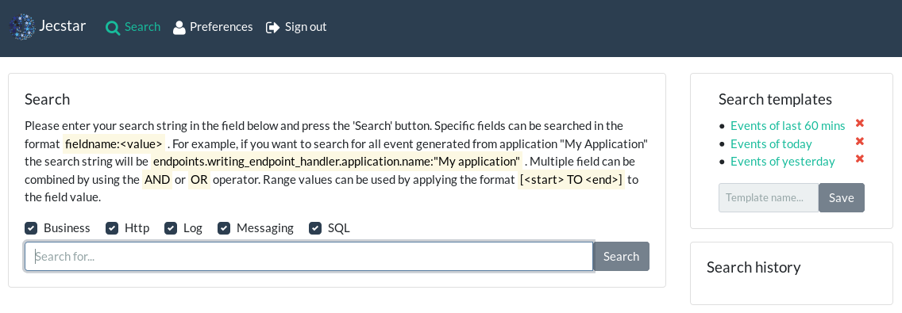
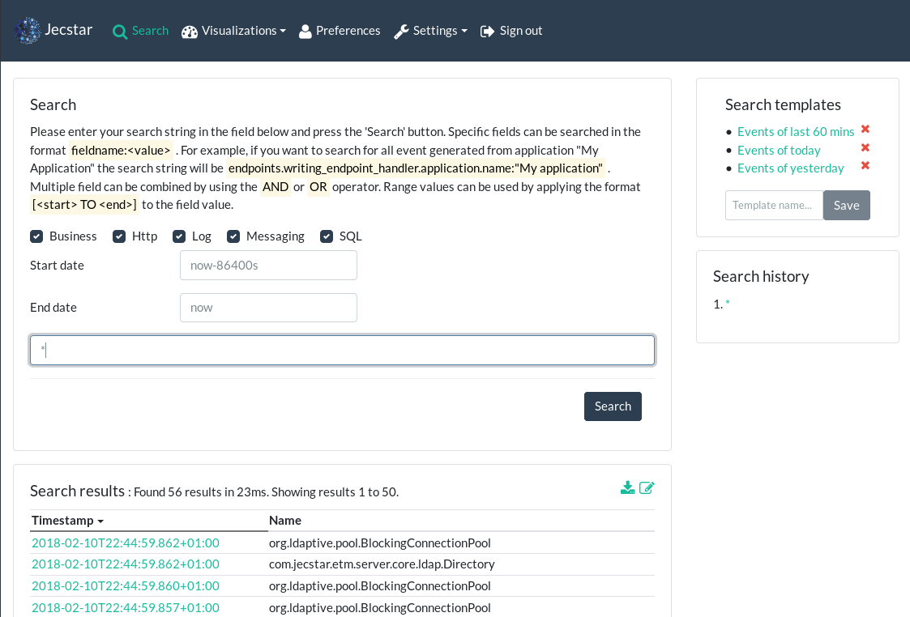
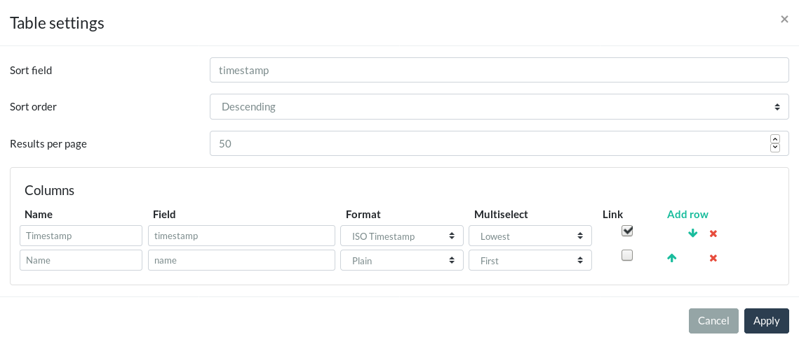
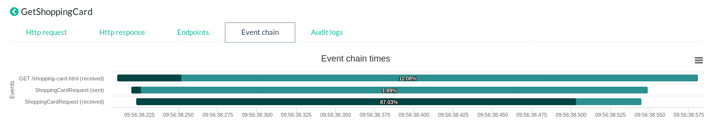
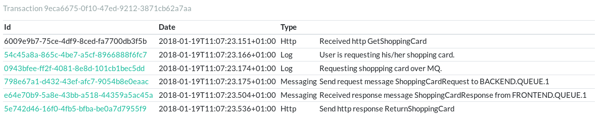

== Searching events
So, you've set up your {etm} nodes and your processors are handling thousands of events per second. Now it's time to take advantage of the performance and simplicity {etm} has to offer.

To search through all events browse to http://localhost:8080/gui/search/ or select the menu option ''Search''. The first time you enter this page it looks similar to the image below.

.Search overview

=== Search widget
The left part of the search screen shows an input field in which you can enter your search terms. Optionally you can filter on any of the known event types by
(un)checking the event types you want to be in- or excluded from the search. To query events in a certain date and time range you may a start- and/or end date.
To select an specific date you can enter that date and time, or select the appropriate value from the popup calendar. If the time range should be more flexible
you can also provide an https://www.elastic.co/guide/en/elasticsearch/reference/{elasticsearch-major-version}/common-options.html#date-math[Elasticsearch Date Math] expression. In the time field you can enter
the name of a field in which the time range should fall.

In the query input field you can enter the terms you are searching for. See the section <<Query syntax>> for the query syntax that can be used. The input field provides a basic form of auto completion by hitting the arrow down button on your keyboard. All available attributes for the selected event types will be show in a drop down box.

=== Search template widget
On the top right of the search screen you see your search templates. By default three most common templates are provided for you, but of course you can change or delete them as you like. To create an search template just fill in a query in the <<Search widget>>, enter a template name and hit the ''Save'' button. If a template with exactly the same name already exist you will see a warning message which asks you to confirm the overwrite of an existing template. All settings regarding the query, like results per page, result columns etc will be stored in your search template.

To use a search template just click on the name in the Search template widget. All setting stored with the search template will be restored to your current search context. 

To delete a search template click on the red cross behind the name and confirm the deletion of the template. If you accidentally removed the wrong template just hit the ''Save'' button again and the search template will be available again. Note that if you changed anything in the search context between the removal and the save of the search template that will be saved as well.

Your {etm} administrator may set a limit on the number of templates that you can store. If the limit is reached a message will be shown in the Search template widget.

=== Search history widget
Under the <<Search template widget>> you'll find the Search history widget. This widget is a read-only widget and stores your last executed queries. By default your last 5 queries will be stored, but this value can be adjusted in your <<User preferences>> screen. Keep in mind that an {etm} administrator is capable of setting a maximum number of queries that can be visible in your Search history widget.

The content of this widget is not bound to any session, so if you login via any other machine you will always see the same history. 

=== Search results widget
As soon as a query is executed the Search result widget will show up. This widget will show you the events that match your query. The default layout of the Search result widget may look like this:

.Search result

The sorting order can be adjusted by clicking on the column header and auto-scrolling through the results will kick in as soon as your browser hit the end of the page. The top of the result table is showing the number of events that match the query and the ones that are shown. 

==== Editing the result table layout
By default only the lowest handling time of any of the writing event handlers and the name of the event will be shown. This may be a good starting point for most of the queries, but is most likely not covering all of your needs. Fortunately all table settings can be adjusted by clicking on the edit table icon in the result table header. This is the right most icon next to the download icon. The following screen will show up when you click on the button:

.Edit search result table

This screen enables you to change sort settings and the number of results per page that should be retrieved. Also an option is given to alter the column layout of the result table. Columns can be added, deleted an re-arranged. Per column the following options are available:

.Column attributes
[options="header"]
|=======================
|Name|Description
|Name|The name of the column in the result table.
|Field|The event attribute that should be retrieved.
|Format|The format the result should have. Time values are stored as milliseconds since January 1st 1970. This is kind of hard to read so you it's easier to convert this value to an ISO timestamp. Note that timestamp formats will show two hourglasses when hovering over the cell in the result table. These hourglasses are shortcuts for using that specific time as start or end date for your next query.
|Multiselect|Some attributes may occur more than ones in a single event. An event can have a writing event handler per endpoint. So if you want to show the handling time of a writing event handler of an event with multiple endpoints {etm} has to pick one. This option tells which value should be selected in case of a multi-occurrence attribute.  
|Link|A checkbox that should be checked if the value should be clickable. If a value is clickable it will be presented as a link in the result table. When clicking this link the details of the event will be shown.
|======================= 

When clicking on the apply button the query will be automatically executed again and the results are then presented in the way you desired. The layout of your result table will also be stored in a search template and in the queries stored in the <<Search history widget>>.

==== Downloading results
If you want to export your search results you can download them as .csv or .xlsx file. By clicking the download icon in the result table header a screen will be shown that gives you some download options. You can select to include the payload in the download and change the number of rows you want to be exported. Besides the payload the columns that are configured in the result table will be included. Be aware that an {etm} administrator can set a maximum number of rows that can be exported. 

When clicking the Download button your export will be presented as downloadable file.

To prevent a large file stored in memory {etm} writes the export file to disk before it is offered as download. The directory referenced by the java.io.tmpdir system property will be used to store the export temporarily. Make sure the {etm} process has access to that directory.

==== Inspecting found events
If any of the columns in the result table is configured as link you can inspect the details of an event. By clicking on that link all data of that event and the events correlated will be shown. Depending on the event type the layout of this screen may differ; for 'http' and 'messaging' events a request and reply tab may be visible. If an transaction id is present with the event an ''Event chain'' tab is shown that shows the complete event chain in a graphical way! If you are allowed to view these events you can click on the desired items in the image to show more details of that specific event. When the payload format of the event is set to 'XML', 'SOAP', 'JSON' or 'SQL' the payload will be formatted to make it more readable. You can copy the raw unformatted content by clicking on 'Copy raw payload to clipboard' on the top left of the payload details. You can navigate back to the search results by clicking the 'Back' button or link. The last selected event will be formatted bold in the search result widget to quickly indicate where you left scrolling your results.

[NOTE]
Although you may not have access right to see all events the Event chain tab will always show all the event that belong to that chain. This may help you greatly reduce time on finding issues in your application landscape.

Lets consider the following event chain:

.Event chain

This chain shows chronologically an incoming (received) http request, a sent ShoppingCardRequest and finally a received ShoppingCardRequest plotted on time. Hovering over one of the time bars show the application and endpoint information. As you can see the bottom time bar is filled for 87%. This indicates that 87% of the total transaction time is spent in that request. When you are experiencing performance issues the 'ShoppingCard (received)' event is a good place to start your investigation.

By clicking on the bottom time bar you will see everything that happened within that transaction:

.Transaction overview

 
As we can see the query that selected the shopping card from the database took about 300 milliseconds. Depending on your needs that might or might not be an issue. Nevertheless {etm} will give you a quick inside in what is happening where an what applications and components take most of the execution time of an entire application chain. That is awesome isn't it?

You might have noticed the 'ShoppingCardRequest (sent)' event also takes about 1.9% of transaction time. That's a little bit odd isn't it? How can an event being sent take processing time? Well, it can't.. The percentage shown of sent events is the latency of the event before it is processed by an application, added with the latency of the response. In this example the sent request and received response have been on a queue for 1.9% of the total transaction time.

[NOTE]
If you have audit log access rights and the audit logs are kept long enough you may see an extra ''Audit Logs'' tab. This tab shows information over who saw this particular event over time. When the column ''Direct'' contains the value ''true'' then the user clicked on this event. When the column contains the value ''false'' the event was retrieved as a correlated event.

=== Query syntax
The query syntax is quite extensive and at the base you can provide a series of terms and operators. By default all event attributes are matched, but specific attributes can be specified to narrow down the query. The query syntax is based on the https://www.elastic.co/guide/en/elasticsearch/reference/${elasticsearch-major-version}/query-dsl-query-string-query.html[Elasticsearch Query DSL].
In large datasets you can improve search performance by always specifying the event attribute you want to query. This allows {etm} to narrow the search down to the given attribute instead of querying them all.  

==== Event attribute names
Searching for specific event attribute can be done with the following syntax:
----
<attribute-name>: value
----

for example this query will search for events where the ''name'' attribute contains ''MyEventName''
----
name: MyEventName
----

Also values can be combined. If you omit the OR operator it will be applied as default.
----
name: (MyEventName OR MyOtherName)
name: (MyEventName MyOtherName)
----

When searching for an exact match the term must be quoted.
----
name: "My Name Should Be An Exact Match!"
----

There are 2 reserved keywords, ''\_exists_'' and ''\_type''. The first one takes an event attribute as parameter. ''\_exists_'' queries for events that contain the provided attribute. ''\_type'' makes it possible to filter on a certain event type.

==== Wildcards
Wildcards can be applied to terms, using ''?'' to replace a single character and ''*'' to replace zero or more characters.

The following query will search for events of which the name contains a term that starts with ''My*''.
----
name: My*
----

CAUTION: Starting a term with a wildcard will be very inefficient and may consume a lot of memory. Try to prevent such queries at any cost because all terms in the index need to be examined.

==== Fuzziness
Sometimes the data in events contains human misspellings. Those misspellings won't match any of the previous mentioned search methods, but with a so called fuzzy search you are still be able to match them. Use the fuzzy operator ''~'' in your query to match terms that are like the given term in the query.
----
name: MyEventNmae~
----

Fuzzy queries use the https://en.wikipedia.org/wiki/Damerau-Levenshtein_distance[Damerau-Levenshtein distance] to find all terms with a maximum of 2 differences. The edit distance can be added to the query:
----
name: MyEvntNmae~4
----

==== Proximity searches
A proximity search allows the specified terms to be close to each other but not necessary next to each other. For example
----
name: "My Name"~5
----

searches for the ''My'' and ''Name'' terms with a term distance of 5. 

==== Ranges
Ranges can be specified to numeric and date attributes. Inclusive ranges are specified with square brackets ''[min TO max]'' and exclusive ranges with curly brackets ''{min TO max}''.

All events of 2018 can be queried as follow
----
endpoints.endpoint_handlers.handling_time: [2018-01-01 TO 2018-12-31]
----

Or all events with a payload length between 1000 and 2000 chars
----
payload_length: [1000 TO 2000]
----

Wildcards can also be applied
----
payload_length: [1000 TO *]
----

And even curly brackets and square brackets can be combined in a single range
----
payload_length: [10 TO 50}
----

For queries without an upper or lower bound the mathematical syntax can be used
----
payload_length:>1000
payload_length:>=1000
payload_length:<1000
payload_length:<=1000
----

==== Boolean operators
By default all provided terms are optional unless they are quoted. This behavior can be changed by adding the boolean operators ''+'' and ''-''. For example
----
name: My +name -must not be +empty
----

states that we are searching for an event with a name that must contain the terms ''name'' and ''empty'', must not contain the term ''must'' and may contain the terms ''My'', ''not'' and ''be''. 

==== Grouping
Terms can be grouped by using parentheses. This is in particular useful if you want to combine multiple ''AND'' and ''OR'' operators
----
name: (My AND name) OR (must AND be) OR empty
----

==== Reserved characters
The reserved characters are: + - = && || > < ! ( ) { } [ ] ^ " ~ * ? : \ /
If you want to use any of these characters in your term(s) you have to escape them by a leading backslash. For example
----
name: \(DemoName\) 
----
searches for an event with the name ''(DemoName)''.

