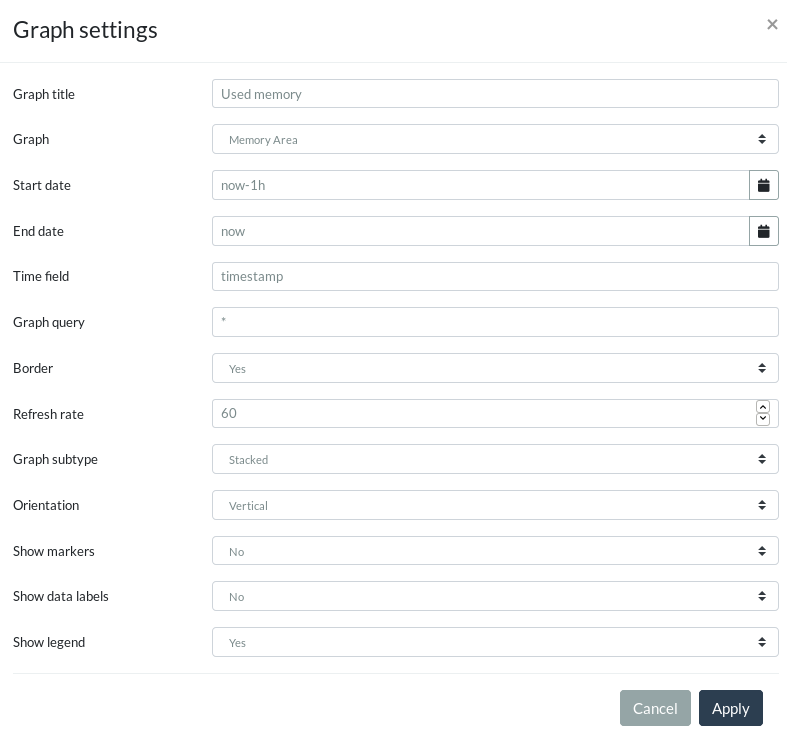
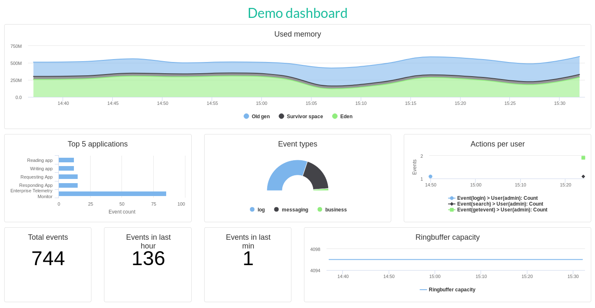

== Visualizations
Besides searching for data {etm} provides a way to visualize statistics on any of the attributes your stored in the <<Event layout>>. Combined with event <<Parsers>> you can extract the specific part of the event payload you are interested in and show statistical information of these parts on a realtime dashboard.

=== Graphs
Graphs are the base items on <<Dashboards>>. Each graph is a visual or numeral representation of a part of your data. A graph can be a single number, but also a chart.

To add, modify or delete graphs browse to http://localhost:8080/gui/dashboard/graphs.html or select the menu option ''Visualizations -> Graphs''. Note that the menu option might be contain a submenu with your username and the groups you belong to. This extra submenu will give you the opportunity to create a graph for a group or just for yourself.

Each graph is uniquely identified by it's name and selects data from a certain datasource. {etm} provides 3 datasources:

. Audits
. Events
. Metrics

The Events datasource contains all event you stored in {etm}. The Metrics datasource contains metric data of all {etm} instances. This information can be very helpful to monitor
your {etm} cluster. Finally the Audits datasource tracks all activities run in {etm}. Depending on your authorizations you might not have access to all datasources.
To narrow down the data used in your graph you can provide a query and a time range on any of the time fields available. This query will be used as filter query for your statistics. Also, when you have the datasource ''Events'' selected one or more <<Filter query>>'s might be applied.

All graphs have 2 fixed configuration sections; Data and Graph. Depending on the selected graph type the sections X-axis, Y-axis, Parts and Category might be visible.

==== Data section
In the Data section you can configure the data that should be in the scope of your graph. This basically comes down to selecting the right datasource and define a time scope for
your graph. Besides exact date and timestamps you can of course use an https://www.elastic.co/guide/en/elasticsearch/reference/{elasticsearch-major-version}/common-options.html#date-math[Elasticsearch Date Math] expression like u used to be in the <<Search widget>>.
To further narrow down the data set you can enter any kind of query in the query field.

==== Graph section
The graph section let you decide how to visualize your data set. Without any doubt the 'Type' option is the most important configuration of your Graph. It let you decide which graph type should be used. Depending on your needs you can select a suitable graph type:

[horizontal]
Area:: The area graph is the way to go when you want to compare several series or are interested in the total of all series.
Bar:: A bar chart provides the most efficient way of displaying time and non time data that might be stacked or grouped.
Line:: Line charts are most useful for time series data.
Number:: Graph with this type selected will show a single number. The number will be the result of a <<Metric aggregator>> or a <<Pipeline aggregator>>.
Pie:: The pie chart gives you the best overview of your sources contribution to the total.
Scatter:: Scatter charts are useful when you want to display the correlation between two variables.

Depending on the selected graph type the following attributes will be visible in the Graphs section
.Dashboard graph attributes
[options="header"]
|=======================
|Name|Description
|Subtype|Can be 'Basic', 'Percentage' or 'Stacked' for the Area and Bar graph, and 'Basic', 'Donut' or 'Semi Circle' for the Pie graph. The 'Percentage' subtype divides each category to a percentage of the total. On the other hand the 'Stacked' subtype stacks all categories. The 'Donut' subtype shows a pie with a hole in the middle and the 'Semi Circle' shows half a donut.
|Line type|This attribute is available for graphs with a line. It determines how the line in the graph should be drawn.
|Orientation|This attribute is available for graphs with a x-axis and y-axis. Switching from 'Vertical' to 'Horizontal' will flip the x-axis and y-axis.
|Show markers|By setting this attribute to 'Yes' each point on the graph will have a marker.
|Show data labels|By enabling this attribute each point on the graph will have it's value displayed.
|Show legend|When set to 'Yes' the graph will contain positioned at the bottom.
|=======================

==== X-axis section
The X-axis section is visible when the graph type is set to 'Area', 'Bar', 'Line' or 'Scatter' and gives you the option to set attribute that should be displayed on the X-axis. The base of the X-axis will always
be a <<Bucket aggregator>>, and can for example be time based by selecting the 'Date histogram' aggregator. Basically, in this section you define on attribute should be plotted on the x-axis, and how big the steps on that axis should be.

==== Y-axis section
Like the <<X-axis section>> the Y-axis section will only be visible when the graph type is set to 'Area', 'Bar', 'Line' or 'Scatter'. In this section you are able to define the values that should be plotted. The 'Title' attribute... well, gives you the
option to add a title to the Y-axis. Furthermore you can add on or more (nested) <<Bucket aggregator,Bucket aggregators>>, <<Metric aggregator, Metric aggregators>> or <<Pipeline aggregator, Pipeline aggregators>>.

The 'Format' is used for configuring the formatting of the values on the Y-axis and deserves <<Format options,it's own section>> in this documentation.

==== Category section
The Category section is only visible for 'Pie' graphs and functions the same as the <<X-axis section>>. It gives you the option to tell which attribute should be used to divide the pie into parts. The size of the parts will be determined in the <<Parts section>>.

==== Parts section
Finally the Parts section is visible for 'Pie' and and 'Number' graphs. Note that although you can add <<Bucket aggregator,Bucket aggregators>> in this section the result must always be a
single <<Metric aggregator>> or <<Pipeline aggregator>>. This means that the <<Bucket aggregator>> must always be configured to not be visible on the graph and nested aggregators can only be used for
<<Pipeline aggregator,Pipeline aggregators>> or a scripted aggregator.

==== Format options
Bar, line and stacked area chart allow you to specify the format used to display the values on the y-axis. The format is based on the https://github.com/d3/d3-format#locale_format[D3 locale format specifier] and has the following format:

[source]
[​[fill]align][sign][symbol][0][width][,][.precision][type]

The 'fill' can be any character. The presence of a fill character is signaled by the 'align' character following it, which must be one of the following:

* > - Forces the field to be right-aligned within the available space. (Default behavior).
* < - Forces the field to be left-aligned within the available space.
* ^ - Forces the field to be centered within the available space.
* = - like >, but with any sign and symbol to the left of any padding.

The 'sign' can be:

* - - nothing for zero or positive and a minus sign for negative. (Default behavior.)
* + - a plus sign for zero or positive and a minus sign for negative.
* ( - nothing for zero or positive and parentheses for negative.
* (space) - a space for zero or positive and a minus sign for negative.

The 'symbol' can be:

* $ - apply currency symbols per the locale definition.
* # - for binary, octal, or hexadecimal notation, prefix by 0b, 0o, or 0x, respectively.

The 'zero' (0) option enables zero-padding; this implicitly sets 'fill' to 0 and 'align' to =. The 'width' defines the minimum field width; if not specified, then the width will be determined by the content. The comma (,) option enables the use of a group separator, such as a comma for thousands.

Depending on the 'type', the 'precision' either indicates the number of digits that follow the decimal point (types f and %), or the number of significant digits (types ​, e, g, r, s and p). If the precision is not specified, it defaults to 6 for all types except ​ (none), which defaults to 12. Precision is ignored for integer formats (types b, o, d, x, X and c).

The available 'type' values are:

* e - exponent notation.
* f - fixed point notation.
* g - either decimal or exponent notation, rounded to significant digits.
* r - decimal notation, rounded to significant digits.
* s - decimal notation with an SI prefix, rounded to significant digits.
* % - multiply by 100, and then decimal notation with a percent sign.
* p - multiply by 100, round to significant digits, and then decimal notation with a percent sign.
* b - binary notation, rounded to integer.
* o - octal notation, rounded to integer.
* d - decimal notation, rounded to integer.
* x - hexadecimal notation, using lower-case letters, rounded to integer.
* X - hexadecimal notation, using upper-case letters, rounded to integer.
* c - converts the integer to the corresponding unicode character before printing.
* (none) - like g, but trim insignificant trailing zeros.

The type n is also supported as shorthand for ,g. For the g, n and ​ (none) types, decimal notation is used if the resulting string would have precision or fewer digits; otherwise, exponent notation is used. For example:

[options="header"]
|=======================
|Format|Input|result
|.2|42|42
|.2|4.2|4.2
|.1|42|4e+1
|.1|4.2|4
|=======================

Some general examples:

[options="header"]
|=======================
|Format|Input|result
|.0%|0.123|12%
|$.2f|-3.5|£3.50
|+20|42|                 +42
|.^20|42|.........42.........
|.2s"|42e6|42M
|#x"|48879|0xbeef
|,.2r|4223|4,200
|=======================

==== Bucket aggregator
Bucket aggregators don't calculate values but are used to group events based on provided criteria. In the context of graphs the bucket aggregators are responsible to split the metric aggregators in certain groups. For example, if you use the Count metric aggregator, a bucket aggregator can split the count value per timeunit or per event type. The following bucket aggregators are available:

[horizontal]
Date histogram:: Groups events per given interval based on a provided date field.
Filter:: Groups events per given attribute name and value.
Histogram:: Groups events per given interval based on a provided numeric field.
Missing:: Groups events that are missing the given attribute.
Significant term:: Group events on the most significant terms of the provided field.
Term:: Groups events on the most or least occurred terms of the provided field.

All bucket aggregators except the 'Filter' and 'Missing' aggregator have the option to set the 'Min nr of events'. By setting this value a bucket can be excluded from the graph if it has less that the configured number of events.
When applied in the <<Y-axis section>> section you can leave the aggregator from the graph by setting 'Show on graph' to 'No'. This option is disabled when applied in the <<Parts section>>.

It is recommended to always give a bucket aggregator a useful 'Name' so it's easier to recognize in the graph or in another aggregator.

==== Metric aggregator
Metric aggregators calculate a value based on the values from the events that are being aggregated. The output of a metric aggregator is a number. The following metric aggregators are available:

[horizontal]
Average:: Calculates the average value of the provided field.
Count:: Count the number of events.
Max:: Select that highest value of the provided field.
Median:: Select the median value of the provided field.
Median absolute deviation:: Calculates the approximate https://en.wikipedia.org/wiki/Median_absolute_deviation[median absolute deviation] of the provided field.
Min:: Select the lowest value of the provided field.
Percentile:: Calculates a given percentile of the provided field.
Percentile rank:: Calculates the percentage of events that is lower or equal than a given percentile rank of the provided field.
Scripted:: Runs a script on every event to calculate a certain value. This bucket uses a 'state' object to pass the values from one script to the next script in the call hierarchy. The following options are available:
Init script;; The init script is executed before any of the data is collected. It can be used to initialize the variables used in further steps. For example `state.transactions = []`
Map script;; The map script is executed on every found document. For example `state.transactions.add(doc.type.value == 'sale' ? doc.amount.value : -1 * doc.amount.value)`
Combine script;; The combine script is run on each Elasticsearch shard after all documents are mapped by the 'Map script'. For example `double profit = 0; for (t in state.transactions) { profit += t } return profit`
Reduce script;; The reduce script is executed on the coordinating node after all combine scripts have returned their results. For example `double profit = 0; for (a in states) { profit += a } return profit`
Sum:: Calculates the sum of the provided field. 
Unique count:: Calculate the number of unique occurrences of the provided field.

You can leave the aggregator from the graph by setting 'Show on graph' to 'No'.

It is recommended to always give a metric aggregator a useful 'Name' so it's easier to recognize in the graph or in another aggregator.

==== Pipeline aggregator
Pipeline aggregators calculate a value based on other aggregators. The output of a pipeline aggregator is a number. The following pipeline aggregators are available:

[horizontal]
Average:: Calculates the average value of the given aggregator values within the given window.
Cumulative sum:: Calculates the cumulative sum over the given aggregator within the given window.
Derivative:: Calculates the derivative of the given aggregator within the given window.
Max:: Select the highest value of the given aggregator values within the given window.
Median:: Select the median value of the given aggregator values within the given window.
Min:: Select the lowest value of the given aggregator values within the given window.
Moving function:: Executes a function on a window of given aggregator values. The following functions are supported:
Double exponential weighted average;; The double exponential weighted average, also known as 'holt' function, incorporates two exponential terms. A level and a trend. This function is most useful when the data has a linear trend.
Exponential weighted average;; Also known as single exponential weighted average works the same as the 'Linear weighted average' function, except older data-points become exponentially less important.
Linear weighted average;; The Linear weighted average function assigns a linear weighting to points in the series, such that "older" datapoints  contribute a linearly less amount to the total average.
Max;; Calculates the highest value of the given aggregator values within the given window.
Min;; Calculates the lowest value of the given aggregator values within the given window.
Standard deviation;; Calculates the standard deviation of the given aggregator values within the given window.
Sum;; Calculates the sum of the given aggregator values within the given window.
Triple exponential weighted average;; The triple exponential weighted average, also known as 'holt-winters' function, incorporates three exponential terms. A level, trend and seasonality. Besides the exponential decays you also need to provide the periodicity of the data and the need to use multiplicative holt-winters or not. This function requires two periods of data to bootstrap. This means that the window of this function needs to be at least twice the size of your period!
Unweighted average;; This function calculates the sum of the given aggregator values within the given window, and then divides that sum by the size of the window.
Scripted:: Runs a script on every aggregator value to calculate a certain value. You can use the result of another aggregator by clicking the 'Add parameter' link. The parameter must be given a name and can be referenced by using 'params.<param_name>' in your scripty value.

Serial differencing:: Subtract a previous value of the given aggregator from the current value. By defining the lag the n-th previous value is used for the subtraction.
Sum:: Calculates the sum of the given field aggregator values.

You can leave the aggregator from the graph by setting 'Show on graph' to 'No'.

It is recommended to always give a pipeline aggregator a useful 'Name' so it's easier to recognize in the graph or in another aggregator.

=== Dashboards
After adding some <<Graphs>> it is time to create your first dashboard. To add, modify or delete dashboards browse to http://localhost:8080/gui/dashboard/dashboards.html or select the menu option ''Visualizations -> Dashboards''. Note that the menu option might be contain a submenu with your username and the groups you belong to. This extra submenu will give you the opportunity to create a dashboard for a group or just for yourself.
A dashboard contains of a set of horizontal rows below each other. Each row can be split into columns and each column can contain a graph.

On the first screen you can enter a dashboard name and add some rows. Change the number of columns per row as needed, and give the rows a suitable height. Don't worry over the exact height of each row right now. When the dashboard is create you can drag the height to the best fit for your screen. When you're done organizing your rows and columns click on the ''Save and show'' button to go to your dashboard. Your dashboard might look like the following image:

.Empty dashboard
image::images/etm-v3/etm-hc-dashboard-start.png["Empty dashboard",link="./images/etm-v3/etm-hc-dashboard-start.png"]

Not much to see there right? The only thing left is to add some <<Graphs>> to the dashboard. When hovering over a graph container the green edit button of that container will show up in the top right corner. A model window will show up with all settings applied to that specific container. Go ahead and select a graph you wish to display. Depending on the graph type several other options will be shown:

.Dashboard graph settings

When finished hit the apply button and your graph will be added to the dashboard. There is no need to save the dashboard again, changes are automatically stored.

A graph on a dashboard can have the following attributes:

.Dashboard graph attributes
[options="header"]
|=======================
|Name|Description
|Graph title|The title that appears on top of the graph container in the dashboard.
|Border|A boolean telling the graph container to display a border around the graph.
|Refresh rate|The rate in seconds the data of the graph should be refreshed.
|=======================

Besides the attributes listed above most options of the <<Data section>> and <<Graph section>> are available as well. By changing these settings you will override the default settings as applied at the Graph.
The selected Graph will act as a template and won't be changed when changing any of the attributes in the Dashboard.

Repeat these steps for all graph containers and your dashboard may look like this:

.Dashboard

When you want to edit the dashboard settings click on the dashboard name and the initial screen will show up. To resize your graph containers drag the bottom right corner of the specific container around on your screen until it has the appropriate size. The dashboard will be automatically saved when any of the graph containers is resized.

