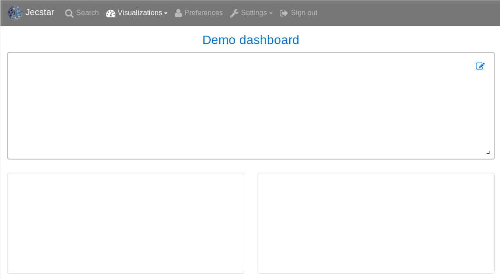
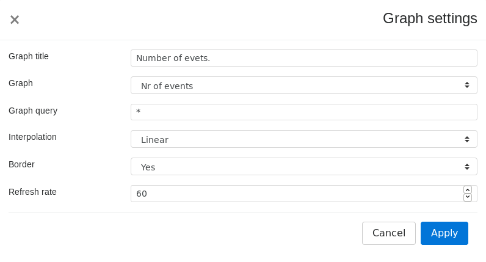
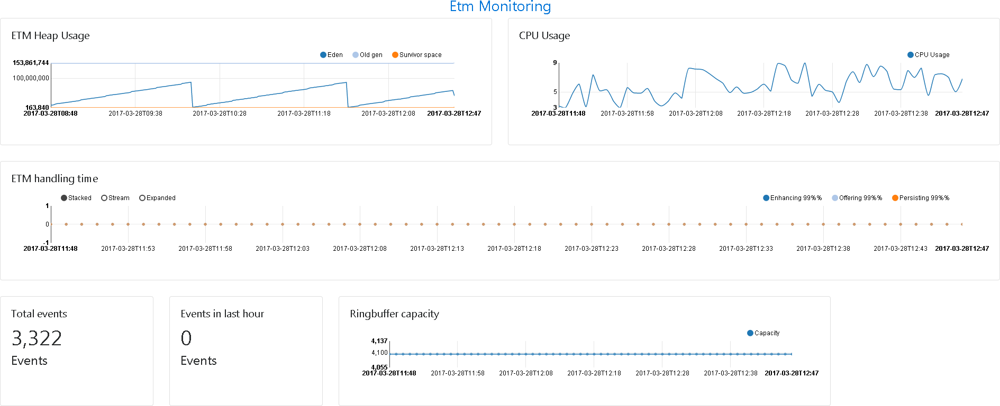

== Visualizations
Besides searching for data {etm} provides a way to visualize statistics on any of the attributes your stored in the <<Event layout>>. Combined with event <<Parsers>> you can extract the specific part of the event payload you are interested in and show statistical information of these parts on a realtime dashboard.

=== Graphs
Graphs are the base items on <<Dashboards>>. Each graph represents a visual representation of a part of your data. A graph can be a single number, but also a chart.

To add, modify or delete graphs browse to http://localhost:8080/gui/dashboard/graphs.html or select the menu option ''Visualizations -> Graphs''.

Each graph is uniquely identified by it's name and selects data from a certain datasource. {etm} provides 2 datasources:

. Events
. Metrics

The Events datasource contains all event you stored in {etm}. The Metrics datasource contains metric data of all {etm} instances. This information can be very helpful to monitor your {etm} cluster.
To narrow down the data used in your graph you can provide a query. This query will be used as filter query for your statistics. Also, if you have the datasource ''Events'' selected one or more <<Filter query>>'s might be applied.

Finally, depending on your needs you can select a suitable graph type:
[horizontal]
Bar chart:: A bar chart provides the most efficient way of displaying time and non time data that might be stacked or grouped. On the y-axis the chart must contain one or more <<Metric aggregator>>s. The x-axis is configured with a <<Bucket aggregator>>. 
Line chart:: Line charts are most useful for time series data. On the y-axis the chart must contain one or more <<Metric aggregator>>s. The x-axis is configured with a <<Bucket aggregator>>.
Number:: Graph with this type selected will show a single number. The number will be the result of a single <<Metric aggregator>>.
Stacked area:: Stacked area are the way to go when you want to compare several series or are interested in the total of all series. On the y-axis the chart must contain one or more <<Metric aggregator>>s. The x-axis is configured with a <<Bucket aggregator>>. 

==== Y-axis format
Bar, line and stacked area chart allow you to specify the format used to display the values on the y-axis. The format is based on the https://github.com/d3/d3-format#locale_format[D3 locale format specifier] and has the following format:

[source]
[​[fill]align][sign][symbol][0][width][,][.precision][type]

The 'fill' can be any character. The presence of a fill character is signaled by the 'align' character following it, which must be one of the following:

* > - Forces the field to be right-aligned within the available space. (Default behavior).
* < - Forces the field to be left-aligned within the available space.
* ^ - Forces the field to be centered within the available space.
* = - like >, but with any sign and symbol to the left of any padding.

The 'sign' can be:

* - - nothing for zero or positive and a minus sign for negative. (Default behavior.)
* + - a plus sign for zero or positive and a minus sign for negative.
* ( - nothing for zero or positive and parentheses for negative.
* (space) - a space for zero or positive and a minus sign for negative.

The 'symbol' can be:

* $ - apply currency symbols per the locale definition.
* # - for binary, octal, or hexadecimal notation, prefix by 0b, 0o, or 0x, respectively.

The 'zero' (0) option enables zero-padding; this implicitly sets 'fill' to 0 and 'align' to =. The 'width' defines the minimum field width; if not specified, then the width will be determined by the content. The comma (,) option enables the use of a group separator, such as a comma for thousands.

Depending on the 'type', the 'precision' either indicates the number of digits that follow the decimal point (types f and %), or the number of significant digits (types ​, e, g, r, s and p). If the precision is not specified, it defaults to 6 for all types except ​ (none), which defaults to 12. Precision is ignored for integer formats (types b, o, d, x, X and c).

The available 'type' values are:

* e - exponent notation.
* f - fixed point notation.
* g - either decimal or exponent notation, rounded to significant digits.
* r - decimal notation, rounded to significant digits.
* s - decimal notation with an SI prefix, rounded to significant digits.
* % - multiply by 100, and then decimal notation with a percent sign.
* p - multiply by 100, round to significant digits, and then decimal notation with a percent sign.
* b - binary notation, rounded to integer.
* o - octal notation, rounded to integer.
* d - decimal notation, rounded to integer.
* x - hexadecimal notation, using lower-case letters, rounded to integer.
* X - hexadecimal notation, using upper-case letters, rounded to integer.
* c - converts the integer to the corresponding unicode character before printing.
* (none) - like g, but trim insignificant trailing zeros.

The type n is also supported as shorthand for ,g. For the g, n and ​ (none) types, decimal notation is used if the resulting string would have precision or fewer digits; otherwise, exponent notation is used. For example:

[options="header"]
|=======================
|Format|Input|result
|.2|42|42
|.2|4.2|4.2
|.1|42|4e+1
|.1|4.2|4
|=======================

Some general examples:

[options="header"]
|=======================
|Format|Input|result
|.0%|0.123|12%
|$.2f|-3.5|£3.50
|+20|42|                 +42
|.^20|42|.........42.........
|.2s"|42e6|42M
|#x"|48879|0xbeef
|,.2r|4223|4,200
|=======================

==== Metric aggregator
Metric aggregators calculate a value based on the values from the events that are being aggregated. The output of a metric aggregator is a number. The following metric aggregators are available:

[horizontal]
Average:: Calculates the average value of the provided field.
Count:: Count the number of events.
Max:: Select that highest value of the provided field.
Median:: Select the median value of the provided field.
Min:: Select the lowest value of the provided field. 
Percentile:: Calculates a given percentile of the provided field.
Percentile rank:: Calculates the percentage of events that is lower or equal than a given percentile rank of the provided field.
Sum:: Calculates the sum of the provided field. 
Unique count:: Calculate the number of unique occurrences of the provided field. 

==== Bucket aggregator
Bucket aggregators don't calculate values but are used to group events based on provided criteria. In the context of graphs the bucket aggregators are responsible to split the metric aggregators in certain groups. For example, if you use the Count metric aggregator, a bucket aggregator can split the count value per timeunit or per event type. The following bucket aggregators are available:

[horizontal]
Date histogram:: Groups events per given interval based on a provided date field. 
Histogram:: Groups events per given interval based on a provided numeric field.
Significant term:: Group events on the most significant terms of the provided field.
Term:: Groups events on the most or least occurred terms of the provided field. 

=== Dashboards
After adding some <<Graphs>> it is time to create your first dashboard. To add, modify or delete dashboards browse to http://localhost:8080/gui/dashboard/dashboards.html or select the menu option ''Visualizations -> Dashboards''.
A dashboard contains of a set of horizontal rows below each other. Each row can be split into columns and each column can contain a graph.

On the first screen you can enter a dashboard name and add some rows. Change the number of columns per row as needed, and give the rows a suitable height. Don't worry over the exact height of each row right now. When the dashboard is create you can drag the height to the best fit for your screen. When you're done organizing your rows and columns click on the ''Save and show'' button to go to your dashboard. Your dashboard might look like the following image:

.Empty dashboard

Not much to see there right? The only thing left is to add some <<Graphs>> to the dashboard. When hovering over a graph container the blue edit button of that container will show up in the top right corner. A model window will show up with all settings applied to that specific container. Go ahead and select a graph you wish to display. Depending on the graph type several other options will be shown:

.Dashboard graph settings

When finished hit the apply button and your graph will be added to the dashboard. There is no need to save the dashboard again, changes are automatically stored.

A graph on a dashboard can have the follwing attributes:

.Dashboard graph attributes
[options="header"]
|=======================
|Name|Description
|Graph title|The title that appears on top of the graph container in the dashboard.
|Graph query|The query that is applied when selecting data. When you have stored a large amount of data make sure your query does narrowing down enough to be suitable for a graph. Showing the number of events per second of an entire year isn't a good idea. This would result in a graph with a point for each second of the year. 
|Interpolation|The interpolation used to create the graph. This tells the graph how the dot's should be connected. The following options are available: *Basis* - A B-spline, with control point duplication on the ends. *Basis closed* - A closed B-spline, as in a loop. *Basis open* - An open B-spline, may not intersect the start or end. *Bundle* - Equivalent to basis, except the tension parameter is used to straighten the spline. *Cardinal* - A Cardinal spline, with control point duplication on the ends. *Cardinal closed* - A closed Cardinal spline, as in a loop. *Cardinal open* - An open Cardinal spline, may not intersect the start or end, but will intersect other control points. *Linear* - Piecewise linear segments, as in a polyline. *Monotone* - Cubic interpolation that preserves monotonicity in y. *Step before* - Alternate between vertical and horizontal segments, as in a step function. *Step after* - Alternate between horizontal and vertical segments, as in a step function.
|Border|A boolean telling the graph container to display a border around the graph.
|Refresh rate|The rate in seconds the data of the graph should be refreshed.
|=======================

Repeat these steps for all graph containers and your dashboard may look like this:

.Dashboard

When you want to edit the dashboard settings click on the dashboard name and the initial screen will show up. To resize your graph containers drag the bottom right corner of the specific container around on your screen until it has the appropriate size. The dashboard will be automatically saved when any of the graph containers is resized.

