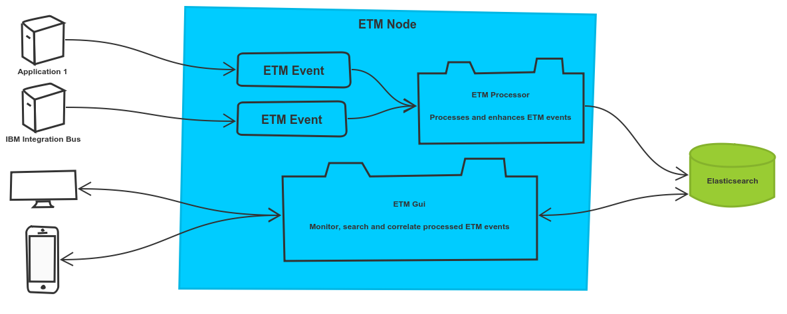

== Getting started
{etm} is a highly scalable event processor. The goal of {etm} is to gain near realtime insights in the information flows inside and between your enterprise applications. It is generally used to help organizations in monitoring their complex application landscape. 

A few sample usecases that {etm} could be used for:

* Correlating events from different applications to create an information flow. These information flows can be individually inspected to locate performance issues in your application chain. 
* Finding the cause of an error in your information flow and pinpointing it to a specific application (component). 
* Act as a central point of information for http, messaging and log events of all of your applications. By giving people access to only certain events it is ensured that people can seen and monitor only the things they are responsible for.
* Combining several event types to get a neat overview of what is happening. With {etm} you are able to see which log lines of any application are belonging to a single user or request. You no longer need to struggle to hundreds of log lines to find what you are searching for.

The rest of this manual will explain to you how you can use {etm} in the most efficient way in your organization.

=== Basic concepts
Before we can go any further it is important to explain the basis concepts of {etm}.

.Cluster
A Cluster is a group of {etm} Nodes forming a distributed application without a single point of failure. Technically speaking a Cluster can be formed with a single Node but this is not a recommended setup.

.Node
A Node is an instance of an {etm} installation. Each node can provide all of the functionalities that {etm} provides.

.Event
An Event is the most basic entity in {etm}. An Event can be an http request, but also a log line from an application. 

.Processor
The Processor is the component that handles the processing of all events. It is capable of enriching and grouping event based on your configuration.

.Transaction
An transaction is a group of Events that belong together. The scope of a Transaction is configurable, and highly dependent on how the Event is handed over to the Processor.

.Gui
The Graphical User Interface of {etm}. You can access {etm} with (almost) any modern browser on any Node. With the Gui your are able to monitor, search and correlate all of the processed events.

.Elasticsearch
The database that is used by {etm}. This database is not provided with the product, but needs to be setup separately if not already available in your organization. More information can be found on the link:https://www.elastic.co/products/elasticsearch[Elasticsearch website].

In short a simple setup could be something like the image below; Application 1 and IBM Integration Bus provide Event to the Processor. The processor is enhancing and saving the Events to the Elasticsarch database. Users are able to query and monitoring events with a browsers on any device.

.{etm} overview

=== Installation
{etm} is written in Java and needs a Java 8 runtime installed on your machine. It is recommended that you use the Oracle JDK version 1.8, but {etm} might run with other JDK suppliers as well. The installation of the Java runtime is not covered in this manual and may differ from platform to platform. Recommendations regarding the Oracle JDK can be found on link:http://docs.oracle.com/javase/8/docs/technotes/guides/install/install_overview.html[Oracle's website]. 
Before you proceed, please check if a correct version of the Java runtime is installed by running:

[source,bash,subs=attributes+]
----
java -version
----

If your organization not already has an Elasticsearch cluster installed it is time to install it now. {etm} needs an Elasticsearch cluster formed of nodes with version 5.2 or compatible. The installation of Elasticsearch is covert at the link:https://www.elastic.co/guide/en/elasticsearch/reference/5.2/\_installation.html[Elastic.co\'s website]. 
Don\'t forget to read the link:https://www.elastic.co/guide/en/elasticsearch/reference/5.2/important-settings.html[important configurations] and link:https://www.elastic.co/guide/en/elasticsearch/reference/5.2/system-config.html[important system configurations] pages! 
{etm} does not require a specific Elasticsearch cluster name and can join any Elasticsearch cluster, but out of the box it is trying to connect to a cluster with the name 'elasticsearch'. {etm} indici and aliases will be prefixed with abbreviation ''etm_''.
  

Once Elasticsearch is up and running you can download and run {etm}. The binaries can be downloaded from link:https://www.jecstar.com/downloads[www.jecstar.com/downloads]. Depending on your operation (or personal
preference) you can download a .zip or .tgz file. In this example we choose the .tgz file, so let's download the binary to our machine:

[source,bash,subs=attributes+]
----
curl -LO https://www.jecstar.com/downloads/etm/etm-{project-version}.tgz
----

Then extract the archive with the following command:

[source,bash,subs=attributes+]
----
tar -zxvf etm-{project-version}.tgz
----

This will extract the archive to the directory etm-{project-version}. We then change to the bin directory of {etm} to fire it up for the first time:

[source,bash,subs=attributes+]
----
cd etm-{project-version}/bin
----

You are now ready to start {etm} with the following command:

[source,bash,subs=attributes+]
----
./etm console
----

IMPORTANT: By default {etm} tries to connect to an Elasticsearch cluster with the name ''elasticsearch'' and a node at 127.0.0.1:9300. If you have changed your Elasticsearch cluster name to something else you should change the {etm} configuration to match the Elasticsearch configuration. How to change the cluster name can be found in the <<Node configuration>> section.

If everything goes well the console will output the following:

[source,bash,subs=attributes+]
----
Running Enterprise Telemetry Monitor...
Enterprise Telemetry Monitor started. 
----

As mentioned above, one of the most common mistakes is a mismatch between the {etm} configuration and the Elasticsearch cluster. If your console prints something like

[source,java,subs=attributes+]
----
Running Enterprise Telemetry Monitor...
NoNodeAvailableException[None of the configured nodes are available: [{#transport#-1}{v1hSCl1dQou7b93zEVw0gA}{127.0.0.1}{127.0.0.1:9300}]]
        at org.elasticsearch.client.transport.TransportClientNodesService.ensureNodesAreAvailable(TransportClientNodesService.java:314)
        at org.elasticsearch.client.transport.TransportClientNodesService.execute(TransportClientNodesService.java:228)
        at org.elasticsearch.client.transport.support.TransportProxyClient.execute(TransportProxyClient.java:63)
        at org.elasticsearch.client.transport.TransportClient.doExecute(TransportClient.java:326)
        at org.elasticsearch.client.support.AbstractClient.execute(AbstractClient.java:403)
        at org.elasticsearch.action.ActionRequestBuilder.execute(ActionRequestBuilder.java:80)
        at org.elasticsearch.action.ActionRequestBuilder.execute(ActionRequestBuilder.java:54)
        at org.elasticsearch.action.ActionRequestBuilder.get(ActionRequestBuilder.java:62)
        at com.jecstar.etm.launcher.ElasticsearchIndextemplateCreator.createTemplates(ElasticsearchIndextemplateCreator.java:54)
        at com.jecstar.etm.launcher.Launcher.launch(Launcher.java:57)
        at com.jecstar.etm.launcher.Startup.main(Startup.java:32)
----

your {etm} configuration cannot find the Elasticsearch cluster. Please contact your Elasticsearch administrator for the correct Elasticsearch connection parameters, and change the setting in the etm.yml file which can be found in the config directory.

When everything is configured well, you can access {etm} with a browser by browsing to link:http://127.0.0.1:8080/gui/[]. During installation an administrative account is created with the username ''admin'' and the password ''password''.

CAUTION: Don't forget to change these default credentials! It is recommended to create a new administrative account and remove the default one as soon as possible.

