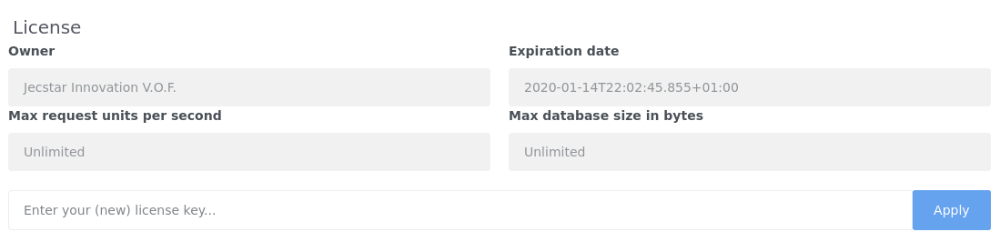

# License registration
One of the first things you need to do as administrator is entering your license key. Without a proper license no events 
will be processed. When your license is expired or not entered you will be able to access all features of Enterprise 
Telemetry Monitor. The only part that is disabled is the processing of events.
To enter your license or view the state of your current license, open a browser and browse to 
<http://localhost:8080/gui/settings/license.html> (Of course your server name and port may be different). If you are 
already logged in to Enterprise Telemetry Monitor you can access the license page through the menu options *Settings -> License*.
Paste your license key in the input field and hit the *Apply* button. If you entered a valid license the license data will become visible.

A correctly applied license looks something like this:

**Enterprise Telemetry Monitor license**


Enterprise Telemetry Monitor can be used with a free license. When possible it will be automatically retrieved and 
applied. This license allows you to consumer 10 [request units](#request-units) per second and store 100 MiB in the 
database. This free license will be valid for 7 days. Within the last 12 hours before the license will expire it will 
be automatically refreshed. If your server can't connect to the internet you can manually download the license from 
the [Jecstar website](https://www.jecstar.com/licenses/index.html). 

## Request Units
Request units are the base of the Enterprise Telemetry Monitor licensing model. Request units are the cost of all 
actions performed on Enterprise Telemetry Monitor. For every 1024 characters that you process with Enterprise
Telemetry Monitor you consume 1 request unit. So with the free license, you will be able to process 10 * 1024 = 10K 
characters per second. 

The cost of a process action will be calculated afterwards. This allows the processor to burst over the maximum 
request units that your license allows. But bursting comes at a cost. The burst will be compensated afterwards by 
throttling the processor. When the processor has burst for, lets say, 50 request units and your license allows for 
10 ru/s the processor will throttle for 5 seconds. 

Besides processing events querying Enterprise Telemetry Monitor will also consume request units. For every action you 
take in the GUI some request units are consumed. For every 1024 characters that are received from the database you
will consume 1 request unit. To prevent long wait times in the GUI it will not allow for bursting. This means that 
you can calculate the minimal execution time from every action on the GUI. If you execute a query that will produce a 
result of 4096 characters and you have the free license of 10 ru/s installed your query will take at least 400ms. 

:::warning Note
Actions in the processor will never influence the available request units in the GUI. So if a processor has consumed 
all ru's the GUI will still be available for querying within the boundaries of the license.
The GUI on the other hand will influence the throughput of the processor. When you execute a query that will consume
5 ru/s, that 5 ru/s can't be used in the processor anymore.
:::

:::warning Note
When running multiple Enterprise Telemetry Monitor nodes in a single cluster the licensed request units are spread 
over all active nodes. So if your license allows for 10 ru/s and you have 2 active Enterprise Telemetry Monitor 
nodes each node is allowed for 5 ru/s. A node becomes inactive when it is shutdown for more than 5 minutes.
::: 

:::tip Tip
To monitor the license usage you can create a [Graph](../visualizations/graphs.md) or [Signal](../signals/README.md) on
any of the following Metric attributes:
* ```event-processor.request-units-processed``` - A counter that shows the number of request units that are processed 
by Enterprise Telemetry Monitor.
* ```license.total-throttle-time``` - The total throttle time of an Enterprise Telemetry Monitor node.
* ```license.total-shape-time``` - The total shape time of an Enterprise Telemetry Monitor.

All above attributes restart at 0 when a node is (re)started.
::: 
